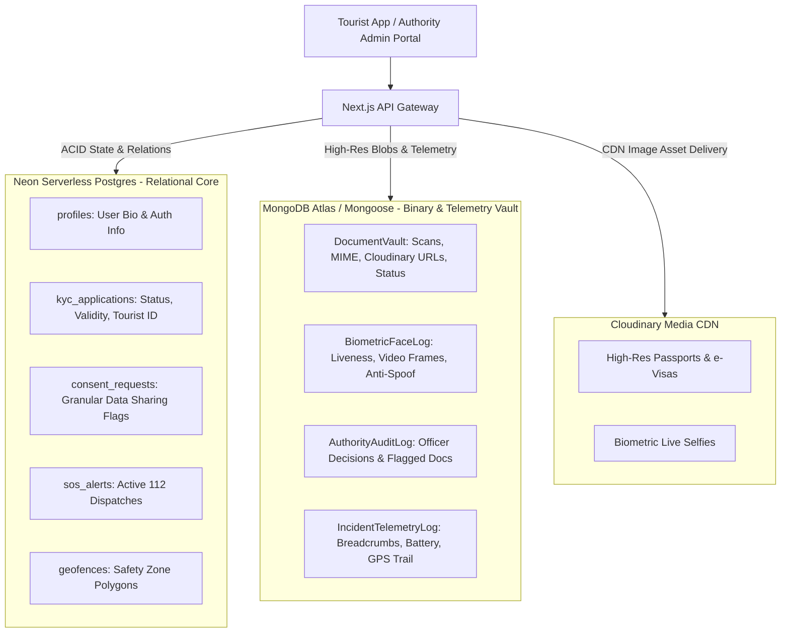

# SafirPass: Comprehensive Dual-Database Architecture

SafirPass utilizes a purpose-built dual-database topology combining **Neon Serverless Postgres** for structured relational transactions and **MongoDB Atlas (Mongoose)** for high-volume document vaults, biometric logs, and spatial incident telemetry.

---

## 1. Division of Responsibilities

---

## 2. Neon Serverless Postgres Schema (`lib/db/postgres.js` & `database/neon_schema.sql`)

| Entity / Table | Primary Responsibility | Key Fields |
| :--- | :--- | :--- |
| **`profiles`** | Authenticated user directory & bio | `id`, `full_name`, `email`, `nationality`, `avatar_url`, `created_at` |
| **`kyc_applications`** | KYC status lifecycle & official ID | `id`, `user_id`, `status` (`under_review` \| `verified` \| `rejected`), `tourist_id`, `passport_number`, `entry_date`, `exit_date`, `device_seal_hash`, `issued_at`, `reviewed_at`, `admin_notes` |
| **`consent_requests`** | Hotel & telecom SIM data sharing | `id`, `user_id`, `requester`, `requester_type`, `attributes`, `shared_attributes`, `status` (`pending` \| `approved` \| `denied`), `decided_at` |
| **`sos_alerts`** | Emergency panic dispatch grid | `id`, `user_id`, `category`, `latitude`, `longitude`, `reference`, `status` (`active` \| `triage` \| `responding` \| `resolved`) |
| **`geofences`** | Safety zones & restricted areas | `id`, `name`, `category`, `latitude`, `longitude`, `radius_meters`, `description` |

---

## 3. MongoDB Atlas Schema via Mongoose (`lib/db/mongoose.js`)

| Collection / Model | Primary Responsibility | Structure / Highlights |
| :--- | :--- | :--- |
| **`DocumentVault`** | Secure document scan store | `user_id`, `tourist_id`, `documents: [{ doc_type, file_name, file_size, mime_type, secure_url, data_url, status: 'pending'\|'verified'\|'failed', failure_reason, verified_at }]`, `uploaded_count`, `all_verified` |
| **`BiometricFaceLog`** | Live WebCam face verification | `user_id`, `tourist_id`, `face_snapshot_url`, `liveness_score` (0.0 - 1.0), `liveness_passed`, `anti_spoof_confirmed`, `captured_at` |
| **`AuthorityAuditLog`** | Immutable government audit trail | `admin_email`, `action` (`APPROVE_KYC` \| `REJECT_KYC`), `target_user_id`, `decision`, `admin_notes`, `failed_documents: []`, `timestamp` |
| **`IncidentTelemetryLog`** | Spatial breadcrumbs & battery logs | `user_id`, `incident_ref`, `location: Point`, `breadcrumbs: [{ latitude, longitude, recorded_at }]`, `device_telemetry` |

---

## 4. Cloudinary Media Asset Integration (`lib/cloudinary.js`)

- Document scans are uploaded to folder `safirpass/documents/`.
- Biometric live captures are uploaded to folder `safirpass/biometrics/`.
- System maintains seamless fallback to MongoDB base64 data URLs when cloud credentials are not supplied.
